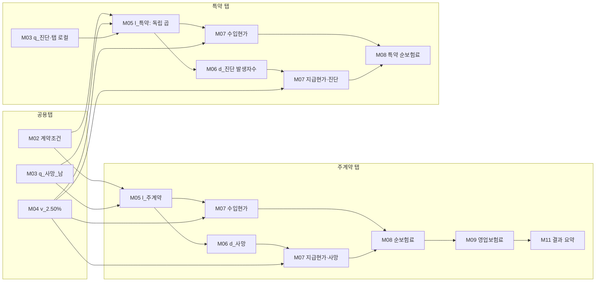
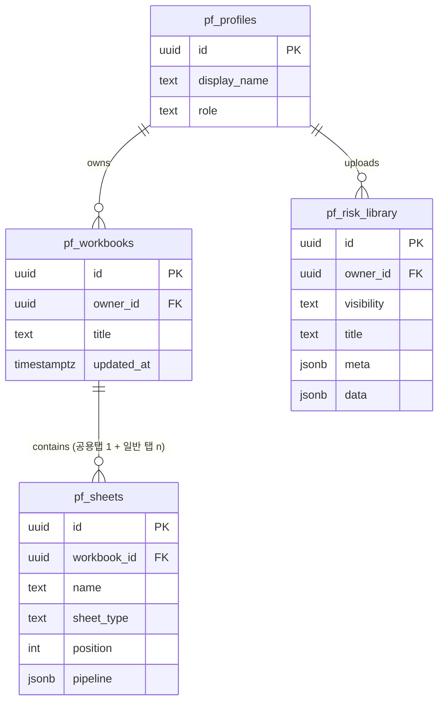

# PremiaFlow : 생명보험 보험료 단계별 산출 웹앱 설계서 v1.1

> **기술 스택**: Next.js 15 (App Router) · TypeScript · TweakCN(shadcn/ui) · Supabase · Vercel
> **문서 목적**: Claude Code에서 본 프로젝트를 구현할 때 참조하는 계획서. CLAUDE.md·AGENT.md·스킬 파일의 상세 내용은 구현 단계에서 작성한다.
> **작성일**: 2026-08-27 · **상태**: v1.1 확정(리뷰 반영 완료)
> **개정 이력**: v1.0 초안 → v1.1 리뷰 6건 확정 반영: 공용탭 공유 모델 채택, 위험률 사망 플래그 도입, 게스트 모드 확정(기능 게이트 대비), 디자인·연납·이름 확정. 상세는 §10.

---

## 0. 요구사항 정리 및 해석

원 요청을 실행 단위로 분해하고, 해석이 갈릴 수 있는 항목에는 기본 해석을 명시했다. 이 목록은 구현 완료 후 검수 체크리스트로도 사용한다.

**요청 정리 (총 12건)**

| # | 태그 | 요구사항 | 설계 반영 위치 |
|---|------|----------|----------------|
| ① | [기능] 단계형 진행: 위에서 아래로 순서대로 데이터를 입력하며 진행하고, 완료된 단계는 접거나 다시 열 수 있음 | 세로 스텝퍼 + 아코디언 카드 패턴 | §3.1, §5.4 |
| ② | [기능] 단계 구성: 상품 기본정보 → 계약조건(연령·성별·보험기간·납입기간) → 위험률 → 이자율·현가율 → 납입자수·생존자수 → 사망자수·발생자수 → 현가합 → 순보험료 → (선택) 사업비·영업보험료 | 모듈 카탈로그 M01~M11 | §3.2 |
| ③ | [기능] 테이블 자동 명명 + 필요 시 사용자가 이름 지정 | 자산(Asset) 명명 규칙 | §3.3 |
| ④ | [기능] 납입자수·생존자수는 경우가 다수이므로 모듈처럼 반복 추가하고 사용자가 선택 | 반복 가능 모듈(다중 인스턴스) | §3.2 M05 |
| ⑤ | [기능] 현가 계산 시 연시 현가·연중 현가 등 옵션을 모듈에서 선택 | 현가 시점 옵션 3종 | §3.2 M07 |
| ⑥ | [기능] 순보험료 산출 후, 사업비율 입력 단계를 사용자가 선택하면 영업보험료까지 산출 | 선택형 모듈 M09 | §3.2 M09 |
| ⑦ | [기능] 각 모듈에서 수식을 드래그앤드롭으로 조립해 간단한 계산 가능 | 수식 빌더(블록형 + 텍스트형) | §3.4 |
| ⑧ | [기능] 완성된 결과에 대해 단계별 Python·VBA 코드가 자동 산출되어 검증에 사용 | 결정론적 코드 생성기 | §3.5 |
| ⑨ | [기능] 탭으로 구분하여 각각 계산하고, 초기 정보·위험률은 탭 간 공유 가능 | 공용탭 모델: 공용탭에 둔 자산만 다른 탭에서 참조 가능 | §2.3 |
| ⑩ | [기능] 산출 결과를 스프레드시트·표 형태로 보고 복사 가능. 결과 조회 화면 제공 | 데이터그리드 + 통합 계산표 + 복사·내보내기 | §3.6 |
| ⑪ | [목적] 정확도·편의성 최우선. 학생 강의·지도용이므로 설명을 팝업 또는 해당 위치에 추가 | 정확도 원칙 + 교육 콘텐츠·강의 모드 | §1.5, §3.7 |
| ⑫ | [확장] 향후 보험료 산출방법서 또는 정형 마크다운 파일을 입력하면 자동으로 결과가 나오는 영역까지 확대 | 파이프라인 JSON 스키마를 v1.0부터 확정하여 확장 대비 | §8 |

**기본 해석과 확정 사항** (리뷰 확정 이력은 §10 참조)

- "사망자수가 발생자가수를 계산"은 "사망자수 및 발생자수를 계산"으로 해석했다.
- 납입주기는 v1.0에서 연납으로 한정하고, 월납·일시납 환산은 v2.0으로 이연한다. (확정)
- 로그인 없이 즉시 사용 가능한 게스트 모드(브라우저 로컬 저장)를 두고, 로그인하면 Supabase에 저장·동기화하는 이중 구조를 채택한다. 강의실에서 학생들의 진입 장벽을 낮추기 위한 선택이다. 다만 일부 기능은 추후 게스트에게 제한할 예정이므로, 기능 단위로 켜고 끌 수 있는 기능 게이트 구조로 구현한다. (확정)
- 위험률 표는 사용자가 업로드·붙여넣기하는 방식을 기본으로 하고, 공용 라이브러리에는 강의용 더미 표만 내장한다. 실제 경험생명표 등은 사용자가 직접 업로드한다. (확정)
- 탭 간 공유는 **공용탭 모델**로 확정한다: 워크북마다 공용탭을 하나 두고, 공용탭에 배치된 기본정보·위험률 등만 다른 탭에서 참조할 수 있다. 주계약에 부가되는 특약 보험료 산출이 대표 사용 사례다. (§2.3)
- 위험률 자산에는 **사망률 여부 플래그**를 두어, 생존자수 구성에서 사망률이 포함된 경우와 포함되지 않은 경우를 구분하고, 복수 탈퇴원인의 결합은 독립 가정(곱)을 기본으로 한다. (§3.2.1)

---

## 1. 프로젝트 컨텍스트

### 1.1 배경과 목적

전통적 수지상등 방식의 생명보험 보험료 산출은 위험률 → 현가율 → 생존·사망자수 → 현가합 → 순보험료 → 영업보험료로 이어지는 명확한 단계 구조를 가진다. 본 앱은 이 단계를 위저드 형태의 파이프라인으로 구현하여, (1) 학부 강의·실습에서 학생이 산출 과정을 단계별로 체험·검증하고, (2) 실무자가 간단한 요율 검산을 빠르게 수행할 수 있게 한다. 각 단계는 표(스프레드시트 뷰)로 즉시 확인되고, 동일 계산을 재현하는 Python·VBA 코드가 자동 생성되어 외부 검증이 가능하다.

대표 사용 사례는 **주계약과 그에 부가되는 특약의 보험료 산출**이다. 공용탭에 계약조건·사망률 등 공통 정보를 두고, 주계약 탭과 특약 탭들이 이를 참조하면서 각자의 발생률과 급부 구조를 더해 보험료를 산출하는 구성을 기본 시나리오로 설계한다(§2.3).

### 1.2 대상 사용자

| 사용자 | 역할 | 주요 시나리오 |
|--------|------|---------------|
| 강의자(관리자) | 공용 위험률 라이브러리 관리, 예제 워크북 배포 | 강의 전 예제 준비, 수업 중 시연 |
| 학생 | 게스트 또는 개인 계정으로 산출 실습 | 과제 수행, 생성 코드로 엑셀·파이썬 검증 |
| 실무·연구 사용자 | 개인 계정으로 검산·비교 | 주계약·특약 구성 검산, 상품 조건 변경 비교(시트 복제) |

### 1.3 입력과 출력

- **입력**: 상품 기본정보, 계약조건(가입연령 x, 성별, 보험기간 n, 납입기간 m, 가입금액 S), 위험률 표(CSV·XLSX 업로드, 클립보드 붙여넣기, 라이브러리 선택), 예정이율 i, 사업비 가정(α·β·γ 또는 단순 부가율), 사용자 정의 수식.
- **출력**: 단계별 계산표(계열), 통합 계산표, 순보험료(NSP·연납 P)와 영업보험료 G 스칼라, TSV 복사·CSV·XLSX 내보내기, 단계별 및 전체 Python(.py)·VBA(.bas) 스크립트.

### 1.4 범위

- **v1.0 포함**: 연납 기준 사망급부·만기(생존)급부·발생급부(진단 등) 산출, 단일·복합 탈퇴(근사, 사망 플래그 구분), 현가 시점 3옵션, 수식 빌더, 코드 생성, 공용탭 기반 탭 간 공유, 게스트·클라우드 저장, 교육 설명·강의 모드.
- **v1.0 제외(→ §8)**: 월납·일시납 환산, 해약환급금·책임준비금, 현금흐름방식, 산출방법서 자동 파싱, 민감도 분석, 결과 비교 뷰.

### 1.5 제약조건

| 구분 | 내용 |
|------|------|
| 정확도 | 모든 계산은 결정론적 TypeScript 엔진으로 수행한다. 내부 계산은 float64로 중간 반올림 없이 진행하고, 표시 자릿수는 별도로 관리한다. 최종 보험료에만 단수처리 옵션(반올림·절사·올림, 자리 지정)을 적용한다. 골든 테스트(§7.3)로 회귀를 방지한다. |
| 성능 | 시트당 모듈 30개, 연령 120행 기준 전체 재계산 100ms 이내(체감 즉시). 계산은 전부 클라이언트에서 수행한다. |
| 접근성 | 키보드로 단계 이동 가능, 표에 caption·헤더 scope 지정, 색 대비 WCAG AA. |
| 보안 | 전 테이블 RLS 적용. 수식 평가기는 자체 파서 기반 샌드박스로 구현하며 eval·Function 사용을 금지한다. 업로드 파일 파싱은 클라이언트에서 처리한다. |
| 브라우저 | 최신 Chrome·Edge·Safari, 데스크톱 우선(강의실 투사 환경 기준). |

### 1.6 용어 정의

| 용어 | 정의 |
|------|------|
| 위험률 q_{x+t} | 연령 x+t의 사망률 또는 급부 발생률 |
| 예정이율 i, 현가율 v^t | v = 1/(1+i), 경과 t년 시점 현가 계수 |
| 기수(radix) l_0 | 계산 출발 인원수(기본 100,000) |
| 생존자수 l_{x+t} | l_{x+t+1} = l_{x+t}·(1 − q_{x+t})로 축차 계산되는 잔존 인원 |
| 납입자수 lp_{x+t} | 보험료 납입 대상 인원. 기본은 생존자수와 동일하되 별도 계열 지정 가능 |
| 사망(발생)자수 d_{x+t} | d_{x+t} = l_{x+t}·q_{x+t} |
| 수입현가·지급현가 | 납입자수 기반 보험료 수입의 현가합, 급부 지급의 현가합(EPV) |
| 수지상등의 원칙 | 수입현가 총합 = 지급현가 총합이 되도록 보험료를 결정하는 원칙 |
| 순보험료 NSP·P | 일시납 순보험료, 연납 순보험료 |
| 영업보험료 G | 순보험료에 예정사업비(α 신계약비, β 유지비, γ 수금비)를 부가한 보험료 |
| 연시·연중·연말 현가 | 급부·납입 시점 가정: v^t, v^{t+1/2}(UDD 가정), v^{t+1} |
| 자산(Asset) | 모듈이 산출하여 이름이 부여된 계열(Series)·표(Table)·스칼라(Scalar). 하류 모듈이 참조한다 |
| 공용탭 | 워크북마다 하나 두는 특수 시트. 여기에 배치된 자산만 다른 탭에서 참조할 수 있다 |
| 사망률 플래그 | 위험률 자산에 부여하는 속성. 해당 계열이 사망률인지(사망급부·사망자수 계산 대상) 다른 발생률·탈퇴율인지 구분한다 |

---

## 2. 페이지 목록 및 사용자 흐름

### 2.1 페이지 목록

| 경로 | 페이지명 | 설명 | 인증 |
|------|----------|------|------|
| `/` | 랜딩 | 한 화면 소개, "바로 시작(게스트)"·"로그인" 진입 | 불필요 |
| `/login` | 로그인 | Google OAuth + 이메일 매직링크(Supabase Auth) | 불필요 |
| `/workbooks` | 워크북 목록 | 생성·복제·삭제, 최근 수정순 | 필요 |
| `/w/[workbookId]` | 작업공간 | 시트 탭 + 단계형 파이프라인 + 결과 패널. 앱의 본체 | 필요 |
| `/w/guest` | 게스트 작업공간 | 동일 UI, localStorage 저장. 로그인 시 클라우드로 가져오기 | 불필요 |
| `/library` | 위험률 라이브러리 | 공용(관리자 등록)·개인 표 관리, 미리보기 | 열람은 게스트 가능, 등록은 로그인 |

### 2.2 사용자 흐름

```mermaid
flowchart TD
    A[랜딩 /] -->|바로 시작| G[게스트 작업공간 /w/guest]
    A -->|로그인| L[/login]
    L --> W[워크북 목록 /workbooks]
    W -->|생성 또는 선택| S[작업공간 /w/id]
    G -->|로그인 후 가져오기| S
    S --> C0[공용탭: 기본정보·공통 위험률 입력]
    C0 --> T[주계약·특약 탭 선택·추가·복제]
    T --> P[단계형 파이프라인 진행: 공용탭 자산 참조]
    P -->|모듈 완료마다| R[결과 요약·통합 계산표 갱신]
    R --> X[TSV 복사 · CSV/XLSX · Python/VBA 내보내기]
    S -.->|위험률 선택 시| LB[/library 라이브러리]
```

### 2.3 개념 모델: 워크북 · 공용탭 · 탭 · 모듈 · 자산

- **워크북**(프로젝트) ⊃ **시트**(탭) ⊃ **파이프라인**(모듈 인스턴스의 순서 목록). 시트는 두 종류다: 워크북마다 하나 두는 **공용탭**과, 산출 케이스별로 만드는 **일반 탭**(주계약·특약 등).
- **공용탭**은 첫 번째 탭으로 고정되며, 여러 탭이 공통으로 쓰는 입력 모듈(계약조건, 공통 위험률, 이자율 등)을 배치하는 자리다. 공용탭에 등록된 자산만 다른 탭에서 참조할 수 있고, 일반 탭에서 만든 자산은 해당 탭 안에서만 참조된다. 별도의 승격·공유 조작은 없다: "공유하려면 공용탭에 둔다"는 단일 규칙으로 동작한다.
- 일반 탭의 참조 선택 콤보박스(AssetPicker)에는 자산이 [현재 탭]과 [공용탭] 두 섹션으로 표시된다.
- 대표 구성은 **주계약 + 특약**이다: 공용탭에 계약조건과 사망률을 두고, 주계약 탭은 이를 그대로 참조하며, 특약 탭은 공용탭의 사망률에 탭 로컬로 업로드한 특약 발생률(진단률 등)을 결합해 산출한다.
- 모듈과 자산은 **의존성 그래프(DAG)**를 이룬다. DAG는 공용탭을 상류로 하여 워크북 수준으로 확장된다: 공용탭 자산이 바뀌면 이를 참조하는 모든 탭의 하류 모듈이 자동 재계산되고, 재계산된 카드에는 배지로 영향 범위를 표시한다.
- 파이프라인 전체는 **JSON 스키마로 직렬화**하여 저장한다(`types/pipeline.ts`). 공용탭도 동일한 파이프라인 구조를 쓴다. 이 스키마가 v2.0 산출방법서·마크다운 자동 변환의 목표 형식이 된다(§8).

파이프라인 의존성 예시(주계약: 20년 만기 정기보험, 특약: 진단특약):



### 2.4 인증·권한 분기

| 상태 | 가능 범위 |
|------|-----------|
| 게스트 | `/w/guest`에서 사용, localStorage 저장, 공용 라이브러리 열람. 클라우드 저장·개인 라이브러리 불가. v1.0에서는 산출 기능 전체를 개방하되, 추후 일부 기능을 게스트에게 제한할 예정이므로 기능 단위 게이트(`lib/features.ts`의 역할별 허용 목록)로 구현하여 정책 변경 시 코드 수정 없이 조정할 수 있게 한다 |
| 로그인 사용자 | 워크북 CRUD, 개인 위험률 라이브러리, 게스트 작업 가져오기 |
| 관리자(role=admin) | 공용 위험률 라이브러리 등록·수정 |

---

## 3. 워크플로우 정의: 계산 파이프라인

### 3.1 단계 진행 UX 규칙

- **세로 스텝퍼 + 아코디언**: TurboTax류 단계형 인터뷰 패턴을 따른다. 현재 단계 카드만 펼쳐지고, 완료된 단계는 요약 칩(핵심 입력값·출력 자산명)으로 접힌다. 클릭하면 다시 펼쳐 수정할 수 있고, 수정 시 하류 재계산 배지가 표시된다.
- **다음 단계 선택**: 단계를 완료하면 카드 하단에 "＋ 다음 단계" 영역이 나타난다. 현재 상태에서 자연스러운 모듈 2~3개를 추천 칩으로 제시하고(예: 위험률 완료 → 이자율·현가율 추천), "전체 모듈 보기"로 카탈로그 전체에서 선택할 수도 있다.
- **모듈 상태**: 대기 → 입력 중 → 완료 → 재계산 필요 → 오류의 5단계 배지로 표시한다.
- 좌측 진행 레일에 모듈 목록·상태를 요약하고, 클릭 시 해당 카드로 스크롤 이동한다.

### 3.2 모듈 카탈로그

| ID | 모듈 | 반복 | 주요 입력·참조 | 옵션 | 출력(자동 명명 예) |
|----|------|------|----------------|------|--------------------|
| M01 | 상품 기본정보 | ✕ | 상품명, 상품유형(정기·생사혼합·순수생존·기타), 메모 | | 메타 정보 |
| M02 | 계약조건 | ✕ | 가입연령 x, 성별, 보험기간 n, 납입기간 m, 가입금액 S | 납입주기(v1.0 연납 고정), 보험료 단수처리(자리·방식) | 스칼라 x, n, m, S |
| M03 | 위험률 표 | ○ | 파일 업로드(CSV·XLSX)·클립보드 붙여넣기·라이브러리 선택 | 컬럼 매핑(연령·남·여 자동 감지), 성별 자동 적용, **사망률 여부 플래그**(라이브러리 메타에서 자동 제안) | 계열 `q1`, `q2`… |
| M04 | 이자율·현가율 | ○ | 예정이율 i(%) | 부리 방식(연복리 고정, v1.0), 표시 자릿수 | 계열 `v1`(예: v_2.50%) |
| M05 | 생존자수·납입자수 | ○ | 탈퇴원인으로 쓸 q 계열(다중 선택, 사망률 포함 여부 자동 구분 표시), 기수 l_0 | 결합 방식(§3.2.1), 용도 태그(생존자수·납입자수) | 계열 `l1`, `lp1` |
| M06 | 사망자수·발생자수 | ○ | 대상 l 계열 × 대상 q 계열 | | 계열 `d1` (d=l·q) |
| M07 | 현가합 | ○ | 유형별 참조(§3.2.2) | 시점(연시·연중·연말), 급부금액(기본 S 참조) | 현가 계열 + 합 스칼라 `PVin1`·`PVout1` |
| M08 | 순보험료 | ✕ | 수입현가·지급현가 스칼라(다중 선택 합산) | 산식 프리셋 표시 | 스칼라 `NSP`, `P_annual` |
| M09 | 사업비·영업보험료 | 선택 | 순보험료, 사업비 가정 | 방식 A·B·C(§3.2.3) | 스칼라 `G_annual`, 부가보험료 분해표 |
| M10 | 사용자 수식 | ○ | 등록된 임의 자산 | 수식 빌더(§3.4) | 계열·스칼라 `f1`… |
| M11 | 결과 요약 | ✕ | 전체 자산 | 통합 계산표 구성 컬럼 선택 | 요약 카드·통합 계산표·내보내기 |

각 모듈 카드는 공통으로 (a) 참조 선택 콤보박스(AssetPicker), (b) 옵션 컨트롤, (c) 결과 미리보기 그리드(복사 버튼 포함), (d) ⓘ 교육 설명 팝오버, (e) `</>` 코드 보기 버튼을 가진다. 공용탭의 모듈 카드에는 (f) 해당 자산을 참조 중인 탭 수 배지가 추가로 표시되어, 수정 시 영향 범위를 미리 알 수 있다.

#### 3.2.1 M05 결합 방식(복수 탈퇴원인 선택 시)

| 방식 | 축차식 | 용도 |
|------|--------|------|
| 단일탈퇴 | l_{t+1} = l_t·(1 − q_t) | 기본 |
| 독립 곱(기본값) | l_{t+1} = l_t·(1 − q1_t)(1 − q2_t)… | 복수 원인, 독립 가정 근사 |
| 단순 합산 | l_{t+1} = l_t·(1 − Σ q_t) | 교육용 단순 근사(중복 무시) |

**사망률 플래그에 따른 구분**: M03에서 각 위험률 계열에 사망률 여부를 표시하면(확정 사항), M05는 선택된 탈퇴원인 구성을 두 경우로 구분해 다룬다.

- **사망률이 포함된 구성**: 카드에 "사망 포함" 배지를 표시하고, 이 l 계열이 M06 사망자수 계산의 기본 대상이 된다. 복수 원인일 때는 위 독립 곱을 기본값으로 결합한다.
- **사망률이 포함되지 않은 구성**(발생률·해지율 등만 선택): "사망 미포함" 배지를 표시한다. 발생자수·납입자수 산출 등 사망급부와 무관한 용도로 쓰이며, M06에서 사망자수 대상으로 선택하면 경고를 띄운다.

두 경우 모두 결합은 독립 가정(곱)을 기본으로 한다. 절대탈퇴율과 다중탈퇴율 간 엄밀한 변환은 v2.0으로 이연하고, 화면과 설명 팝오버에 근사 방식임을 명시한다. 납입자수는 별도 인스턴스로 만들어 다른 탈퇴 구성(예: 납입면제 반영)을 적용할 수 있다.

#### 3.2.2 M07 현가합 유형

| 유형 | 계산 | 기간 | 시점 기본값 |
|------|------|------|-------------|
| 수입현가 | Σ lp_{x+t}·v^{t+s} | t = 0 … m−1 | 연시(s=0) |
| 지급현가(사망·발생급부) | Σ 급부금액·d_{x+t}·v^{t+s} | t = 0 … n−1 | 연말(s=1), 연중(s=1/2) 선택 가능 |
| 지급현가(만기·생존급부) | 급부금액·l_{x+n}·v^n | t = n | 고정 |

현가는 기수 l_0 기준의 집단 총액으로 계산하고, 보험료 산식에서 인원으로 나누어 1건당 값으로 환산한다. 현가 계열(연도별 값)과 합계 스칼라를 모두 자산으로 등록하여 표에서 확인할 수 있게 한다.

#### 3.2.3 M08·M09 산식 프리셋

- **일시납 순보험료**: NSP = (지급현가 총합) / l_x
- **연납 순보험료**: P = (지급현가 총합) / (수입현가 총합). 수입현가가 보험료 1원 기준이므로 P가 곧 1건당 연납보험료가 된다. 지급현가에는 급부금액이 이미 반영되어 있다.
- **영업보험료 방식 A(3이원 수지상등 확장)**: G·(수입현가 총합) = (지급현가 총합) + α·S·l_x + β·S·Σ_{t=0}^{n−1} l_{x+t}·v^t + γ·G·(수입현가 총합) 을 G에 대해 풀어 산출한다. α는 가입금액 대비 신계약비(계약 시 1회), β는 가입금액 대비 연간 유지비(보험기간 연시), γ는 영업보험료 대비 수금비(납입기간)로 정의하고, 정의는 화면에 함께 표시한다.
- **방식 B(단순 부가율)**: G = P / (1 − k)
- **방식 C(사용자 수식)**: M10 수식 빌더 결과를 참조한다.

모듈 카드에는 선택된 산식이 계리 기호로 렌더링되어 학생이 수식과 숫자를 대응시킬 수 있다.

### 3.3 자산 자동 명명 규칙

| 자산 종류 | 자동 코드명 | 표시명 자동 제안 예 |
|-----------|-------------|---------------------|
| 위험률 계열 | `q1`, `q2`… | q_사망_남 (라이브러리 메타에서 생성) |
| 현가율 계열 | `v1`… | v_2.50% |
| 생존자수·납입자수 | `l1`·`lp1`… | l_주계약, lp_주계약 |
| 사망·발생자수 | `d1`… | d_사망 |
| 현가 | `PVin1`·`PVout1`… | PV_수입, PV_사망지급 |
| 보험료 스칼라 | `NSP`, `P_annual`, `G_annual` | 고정 |
| 수식 결과 | `f1`… | 사용자 지정 |

- **표시명**(한글 허용)과 **코드 식별자**(`^[a-z][a-z0-9_]{0,29}$`, ASCII)를 분리한다. 표시명 변경 시 코드 식별자를 자동 슬러그로 제안하고 수정할 수 있다. 코드 식별자는 수식 빌더와 생성 코드의 변수명으로 그대로 쓰이므로, 일반 탭 자산은 해당 탭 범위에서, 공용탭 자산은 워크북 전체 범위에서 유일성을 검사한다(일반 탭 자산이 공용탭 자산과 같은 이름을 갖지 못하게 하여 참조 혼동을 막는다).
- 이름 변경 시 참조 중인 하류 모듈·수식의 참조가 자동으로 따라간다(내부적으로는 자산 ID로 참조).

### 3.4 수식 빌더(M10 및 각 모듈 보조 계산)

- **블록 모드(기본)**: 팔레트에서 토큰을 드래그해 수평으로 배열한다. 토큰 종류: 자산 참조 칩, 숫자 상수, 경과기간 인덱스 `t`, 연산자(＋ − × ÷ ^), 괄호 블록, 함수 블록.
- **함수 목록(v1.0)**: `SUM(s)`, `CUMSUM(s)`, `SHIFT(s, k)`(k만큼 지연, 빈자리 0), `ROUND(x, d)`, `FLOOR(x, d)`, `CEIL(x, d)`, `MIN`, `MAX`, `IF(cond, a, b)`, `POW(a, b)`.
- **텍스트 모드(고급)**: 엑셀식 수식을 자동완성과 함께 입력한다. 두 모드는 동일한 AST로 상호 변환된다.
- **평가 규칙**: 자체 토크나이저·파서로 AST를 만들고 요소별(element-wise)로 평가한다. 계열과 스칼라 혼합 시 브로드캐스트하고, 계열 길이 불일치·순환 참조·미정의 참조는 입력 중 즉시 인라인 오류로 표시한다. eval·Function은 사용하지 않는다.
- 결과는 미니 그리드로 즉시 미리보기하고, 확정 시 자산으로 등록되어 다른 모듈이 참조할 수 있다.

### 3.5 코드 자동 생성(Python·VBA)

- **원칙**: LLM을 사용하지 않는 결정론적 템플릿 방식으로 생성한다. 동일 파이프라인은 항상 동일 코드를 만든다.
- **Python**: numpy·pandas 기반. 입력값(계약조건·위험률 배열·이율·옵션)을 리터럴로 포함하고, 모듈별로 주석 블록을 나누어 단계별 DataFrame을 출력하며 마지막에 보험료를 print한다. 단계별 조각과 전체 스크립트(.py)를 모두 제공한다.
- **VBA**: 표준 모듈의 Sub 프로시저로 배열 계산 후 단계별 표를 워크시트에 기록한다(.bas 다운로드).
- **UI**: 각 모듈 카드의 `</>` 버튼 → 코드 패널(Python·VBA 탭, 복사 버튼). 헤더의 "전체 스크립트 내보내기"로 파이프라인 전체를 한 파일로 받는다.
- **정합성 보장**: 골든 케이스에 대해 생성된 Python을 실제 실행하여 엔진 결과와 대사하는 자동 테스트를 CI에 포함한다(§7.3). 사용자 수식(M10)도 동일 AST에서 Python·VBA 표현식으로 변환한다.

### 3.6 결과 조회·복사·내보내기

- **모듈별 그리드**: 각 카드에 경과기간 t·연령 x+t를 행으로 하는 미리보기 표. 컬럼 헤더에 정의 수식 툴팁(예: d_{x+t} = l_{x+t}·q_{x+t}).
- **통합 계산표(M11)**: 시트의 모든 계열 자산을 t 인덱스로 조인한 산출검증표. 엑셀 검증 시트와 동일한 감각으로 훑어볼 수 있고, 표시할 컬럼을 선택할 수 있다.
- **결과 요약 패널**: 작업공간 우측 고정 패널에 NSP·연납 P·영업보험료 G와 핵심 가정 요약을 항상 표시한다.
- **복사·내보내기**: 표 전체 또는 선택 영역을 TSV로 복사(엑셀 붙여넣기 호환, 헤더 포함 옵션), CSV 다운로드, XLSX 내보내기(SheetJS: 입력 요약·단계별·통합 계산표 시트 구성).

### 3.7 교육 기능

- 각 모듈 헤더의 ⓘ 팝오버: 개념 설명 1문단 + 핵심 수식(KaTeX 렌더링) + 3행짜리 미니 예시.
- **강의 모드 토글**(헤더): 모든 설명을 펼쳐 표시하고, 계리 기호 표기(ä_{x:m|}, A¹_{x:n|} 등)와 산식 유도 단계를 함께 보여준다.
- 설명 문안은 `content/`에 정적 콘텐츠(모듈별 MDX 또는 JSON)로 관리한다. 초안은 구현 단계에서 작성하고 사용자(강의자)가 검수한다(사람 검토).

### 3.8 LLM 판단 영역과 코드 처리 영역

| 구분 | 내용 |
|------|------|
| 런타임 코드(결정론) | 모든 보험료 계산, 수식 평가, 코드 생성, 파일 파싱, 검증. **런타임에 LLM을 일절 사용하지 않는다(v1.0)** |
| 구현 시 LLM(Claude Code) 판단 | 컴포넌트 구조 설계, UI 패턴 선택, 설명 문안 초안, 접근성·가독성 검토 |
| 런타임 LLM(v2.0 한정) | 산출방법서·비정형 문서를 파이프라인 JSON으로 변환하는 파싱 단계에만 사용(§8) |

### 3.9 런타임 실패 처리

| 상황 | 처리 |
|------|------|
| 업로드 파일 파싱 실패·형식 모호 | 오류 안내 후 컬럼 매핑 UI로 에스컬레이션(사용자가 직접 지정) |
| 위험률 검증 실패(연령 불연속, q∉[0,1], 결측) | 해당 셀 하이라이트 + 수정·보간(빈값 0 처리) 선택 제시 |
| 수식 오류(문법·순환·길이 불일치) | 인라인 오류 표시, 마지막 유효 결과 유지 |
| 참조 자산 삭제·범위 부족 | 하류 모듈을 "재계산 필요·오류" 상태로 전환하고 계산 보류, 원인 자산 링크 표시 |
| 저장 실패(네트워크) | 로컬 임시 보관 후 재시도, 토스트 안내 |

---

## 4. 데이터 모델 (Supabase)

### 4.1 테이블 개요 (프리픽스 `pf_`)

| 테이블 | 설명 | RLS |
|--------|------|-----|
| `pf_profiles` | id(auth.users FK), display_name, role(user·admin) | ✅ 본인 행만 select·update |
| `pf_workbooks` | id, owner_id, title, memo, created_at, updated_at | ✅ owner 전권 |
| `pf_sheets` | id, workbook_id, name, sheet_type(shared·normal), position, pipeline JSONB, updated_at | ✅ 워크북 owner 경유 |
| `pf_risk_library` | id, owner_id(null=공용), visibility(public·private), title, source_note, meta JSONB(사망률 여부 포함), data JSONB, created_at | ✅ public은 전체(익명 포함) select, private은 owner만, 공용 등록·수정은 admin만 |

- 파이프라인(모듈 구성·옵션·수식·자산)은 `pf_sheets.pipeline` JSONB 하나에 직렬화한다. 위험률 데이터는 연령 0~120 × 수 개 컬럼 수준이므로 JSONB로 충분하다.
- **공용탭은 `sheet_type = 'shared'`인 시트 행**으로 저장한다(워크북당 1개, 워크북 생성 시 자동 생성, position 0 고정, 부분 유니크 인덱스로 강제). 공용탭의 pipeline에 등록된 자산이 곧 워크북 공유 자산이므로, 별도의 공유 자산 테이블은 두지 않는다. 일반 탭의 참조는 자산 ID(공용탭 시트 ID + 자산 ID)로 저장한다.
- 원본 업로드 파일 보관(Storage)은 v1.0에서 생략하고 파싱 결과 JSON만 저장한다.
- Realtime 구독은 v1.0에 없다. 자동 저장은 변경 디바운스(2초) 방식이다.

### 4.2 ERD



### 4.3 인증과 저장 구조

- Supabase Auth: Google OAuth + 이메일 매직링크.
- 저장 계층은 `lib/storage/`의 어댑터 인터페이스로 추상화한다: `localAdapter`(게스트, localStorage)와 `cloudAdapter`(Supabase)가 동일 인터페이스를 구현하고, 로그인 시 로컬 워크북을 클라우드로 가져오는 마이그레이션 함수를 둔다.

---

## 5. UI/UX 설계 방향

### 5.1 디자인 컨셉·톤

- **확정 톤: 중립 라이트 에디토리얼 + 계산 그리드**(리뷰 확정). 근거: 강의실 투사와 인쇄물 배포에 유리한 밝은 배경, 표·숫자가 주인공인 도구 특성상 채도를 억제하고 타이포그래피와 여백으로 위계를 만든다. 다크 테크 톤은 표 가독성과 투사 환경에서 불리하여 배제했다. tkLeen 브랜드 전면 적용(Fraunces·로고)은 하지 않고 포인트 컬러만 가져온다.
- **컬러 토큰(확정)**: `--primary` Sky Blue #4A90C2(tkLeen 시그니처 포인트), `--background` 웜 화이트, `--muted` 그레이, `--accent` 완료 상태용 그린 계열, 시맨틱(success·warning·destructive) 별도. 공용탭에는 다른 탭과 구분되는 탭 색(예: primary 틴트 배경)을 적용한다.
- **타이포그래피**: 본문 Pretendard, 숫자·표·코드 JetBrains Mono(자릿수 정렬 tabular-nums), 수식 KaTeX.

### 5.2 핵심 컴포넌트

| 컴포넌트 | 역할 |
|----------|------|
| `Stepper`·`StepCard`·`StepSummaryChip` | 진행 레일, 아코디언 단계 카드, 완료 요약 칩 |
| `AssetPicker` | 자산 참조 선택 콤보박스([현재 탭]·[공용탭] 섹션, 종류 아이콘, 사망률 플래그 표시) |
| `DataGrid`·`CopyToolbar` | TanStack Table + 가상 스크롤 그리드, TSV 복사·CSV 버튼 |
| `UnifiedSheetView` | 통합 계산표(컬럼 선택 포함) |
| `FormulaCanvas`·`BlockPalette`·`TextFormulaInput` | 수식 빌더(dnd-kit 기반 블록·텍스트 이중 모드) |
| `CodePanel` | Python·VBA 탭, 복사·다운로드 |
| `InfoPopover`·`LectureModeToggle` | 교육 설명, 강의 모드 |
| `SheetTabBar` | 시트 탭 바: 공용탭이 첫 탭으로 고정(삭제 불가, 구분 색), 일반 탭 추가·복제·이름 변경 |
| `ResultSummaryPanel` | 우측 고정 결과 요약 |
| `RecalcBadge` | 재계산 필요·오류 상태 배지 |

### 5.3 TweakCN 활용 방향

- 커스터마이징 대상: `Button`(포인트 컬러·weight 600), `Card`(단계 카드: 얇은 보더 + 상태별 좌측 컬러 바), `Collapsible`·`Accordion`(단계 접힘), `Tabs`(시트 탭·코드 패널), `Select`·`Combobox`(AssetPicker), `Table`(밀도 컴팩트, tabular-nums), `Popover`·`Tooltip`(설명·수식), `Sheet`(코드 패널·보조 서랍), `Badge`(모듈 상태·사망 포함 여부·공용탭 참조 수), `Toggle`(강의 모드), `Sonner`(저장·오류 토스트).
- 토큰 기반 테마(`--primary`, `--accent`, `--muted`, radius)를 TweakCN에서 정의하고 전 컴포넌트에 일괄 적용한다.

### 5.4 레이아웃·반응형·인터랙션

- **작업공간 레이아웃**: 상단 시트 탭바 + 헤더(강의 모드·내보내기), 좌측 진행 레일(240px), 중앙 단계 카드 스택, 우측 결과 요약 패널(320px 고정).
- **브레이크포인트**: ≥1280px 3열 전체, 1024~1279px 결과 패널 접이식(플로팅 버튼), <1024px(태블릿·모바일) 단일 열 + 결과 요약 하단 시트, 열람·간단 수정 위주.
- **인터랙션**: 단계 완료 시 다음 카드로 부드러운 스크롤 포커스, 상류 수정 시 하류 카드에 재계산 배지 펄스, 수식에서 자산 칩 호버 시 해당 그리드 컬럼 하이라이트(수식과 표의 대응을 시각화하는 교육 장치). 과한 장식 애니메이션은 배제한다.

### 5.5 프론트엔드 라이브러리

TanStack Table + @tanstack/react-virtual(그리드), dnd-kit(수식 블록), Zustand(파이프라인 상태·DAG), KaTeX(수식), SheetJS(XLSX 파싱·내보내기), Papa Parse(CSV). 차트는 v1.0 범위 밖이다(l·d 곡선 시각화는 v2.0).

---

## 6. 구현 스펙

### 6.1 폴더 구조 (Next.js 15 App Router)

```
/premiaflow
  ├── CLAUDE.md
  ├── .claude/
  │   ├── skills/
  │   │   ├── golden-tests/        # SKILL.md, scripts/, references/
  │   │   ├── codegen-templates/
  │   │   ├── table-io/
  │   │   └── actuarial-content/
  │   └── agents/
  │       ├── db-architect/AGENT.md
  │       ├── calc-core/AGENT.md
  │       ├── codegen-engineer/AGENT.md
  │       └── ui-builder/AGENT.md
  ├── app/
  │   ├── (marketing)/page.tsx         # 랜딩
  │   ├── (auth)/login/
  │   ├── (studio)/workbooks/
  │   ├── (studio)/w/[workbookId]/
  │   ├── (studio)/w/guest/
  │   ├── (studio)/library/
  │   ├── api/                         # v1.0 최소(필요 시 내보내기 보조)
  │   └── layout.tsx
  ├── components/
  │   ├── ui/                          # TweakCN 기본 컴포넌트
  │   ├── pipeline/                    # Stepper, StepCard, RecalcBadge …
  │   ├── modules/                     # m01-product … m11-output 모듈별 폼·미리보기
  │   ├── grid/                        # DataGrid, CopyToolbar, UnifiedSheetView
  │   ├── formula/                     # BlockPalette, FormulaCanvas, TextFormulaInput
  │   ├── codegen/                     # CodePanel
  │   └── assets/                      # AssetPicker, SharedAssetDrawer
  ├── lib/
  │   ├── engine/                      # series.ts, decrement.ts, pv.ts, premium.ts, graph.ts
  │   ├── formula/                     # tokenizer.ts, parser.ts, evaluator.ts
  │   ├── codegen/                     # python/, vba/, assemble.ts
  │   ├── supabase/                    # client.ts, server.ts, queries/
  │   ├── storage/                     # adapter.ts, localAdapter.ts, cloudAdapter.ts
  │   ├── store/                       # workbook.ts (Zustand)
  │   ├── features.ts                  # 역할별(게스트·로그인·관리자) 기능 게이트 허용 목록
  │   └── utils/
  ├── types/                           # pipeline.ts(직렬화 스키마), assets.ts, modules.ts
  ├── content/                         # 모듈별 교육 설명(MDX·JSON)
  ├── output/                          # 에이전트 중간 산출물
  └── docs/
      ├── references/                  # 디자인·라이브러리 참고
      └── domain/                      # schema.md(ERD), premium-method.md(산식 정리), golden-cases.md
```

### 6.2 CLAUDE.md 핵심 섹션 목록

1. 프로젝트 개요와 목표(정확도 최우선 선언)
2. 기술 스택·코딩 규칙(TS strict, 서버·클라이언트 경계, 계산은 클라이언트)
3. 계산 정확도 원칙(중간 미반올림, 결정론, 골든 테스트 절차와 통과 의무)
4. 모듈·자산 명명 규칙(표시명·코드 식별자 분리)
5. 파이프라인 JSON 스키마 참조(`types/pipeline.ts`)
6. 서브에이전트 오케스트레이션 규칙(호출 조건, `/output/` 경로 규약)
7. 검증 루틴(빌드·타입·vitest·Python 대사 테스트 순서)
8. 금지사항(계산 경로에 LLM 사용 금지, eval·Function 금지, RLS 우회 금지)

### 6.3 에이전트 구조: 메인 오케스트레이터 + 서브에이전트 4

서브에이전트를 분리하는 이유: 계산 정확도가 핵심인 엔진·코드 생성 영역과 UI 영역이 참조하는 지식·검증 방식이 서로 다르고, 페이지·모듈 수가 많아 단일 지침이 길어지기 때문이다. 서브에이전트 간 직접 호출은 금지하고 메인이 조율한다.

| 서브에이전트 | 역할 | 트리거 조건 | 입출력 |
|--------------|------|-------------|--------|
| `db-architect` | pf_ 스키마·RLS·마이그레이션 SQL | 데이터 모델 신설·변경 | 입력: 본 설계서 §4 / 출력: `/output/schema.sql`, `docs/domain/schema.md` |
| `calc-core` | 계산 엔진(계열 연산·탈퇴·현가·보험료), 수식 파서·평가기, 골든 테스트 | 계산 로직 신설·수정 | 입력: §3, `docs/domain/premium-method.md` / 출력: `lib/engine/`, `lib/formula/`, 테스트 리포트 |
| `codegen-engineer` | Python·VBA 템플릿, 전체 스크립트 조립, Python 대사 테스트 | 코드 생성 기능 작업 | 입력: 파이프라인 스키마, `/output/module_catalog.json` / 출력: `lib/codegen/` |
| `ui-builder` | 단계 UI·그리드·수식 빌더 UI·TweakCN 토큰 | 페이지·컴포넌트 구현 | 입력: §3.1, §5 / 출력: `app/`, `components/` |

**데이터 전달**: 크거나 구조화된 산출물(스키마, 모듈 카탈로그 정의, 골든 케이스 정의)은 `/output/step{n}_*.json` 파일로 저장하고 경로만 전달한다. 짧은 설정값은 프롬프트 인라인으로 전달한다.

### 6.4 스킬 목록

| 스킬명 | 역할 | 트리거 조건 |
|--------|------|-------------|
| `golden-tests` | 골든 케이스 정의·기대값 관리·실행 절차 | 엔진·모듈 계산 수정 시 반드시 실행 |
| `codegen-templates` | Python·VBA 템플릿 규약·스타일·대사 테스트 방법 | 코드 생성 기능 작업 시 |
| `table-io` | CSV·XLSX 파싱, 컬럼 매핑, 위험률 검증 규칙 | 위험률 입출력 작업 시 |
| `actuarial-content` | 교육 설명 문안 톤·용어·KaTeX 표기 지침 | 설명 콘텐츠 작성 시 |

### 6.5 환경 변수

| 변수명 | 용도 |
|--------|------|
| `NEXT_PUBLIC_SUPABASE_URL` | Supabase 프로젝트 URL |
| `NEXT_PUBLIC_SUPABASE_ANON_KEY` | Supabase 공개 키 |
| `SUPABASE_SERVICE_ROLE_KEY` | 관리 스크립트·시드 전용(서버 한정) |
| `NEXT_PUBLIC_APP_URL` | 매직링크 리다이렉트 기준 URL |
| `ANTHROPIC_API_KEY` | v2.0 산출방법서 파싱 전용(v1.0 미사용) |

---

## 7. 빌드 순서와 단계별 검증

### 7.1 빌드 페이즈

정확도 최우선 원칙에 따라 **UI보다 계산 엔진과 골든 테스트를 먼저** 구축한다.

| Phase | 산출물 | 성공 기준 | 검증 방법 | 실패 시 처리 |
|-------|--------|-----------|-----------|---------------|
| P0 스캐폴딩 | Next.js 15 + TweakCN 테마 + Supabase 연결 + 라우팅 골격 + 타입 골격 | 빌드·타입 오류 0 | 규칙 기반 | 자동 재시도(최대 3회) |
| P1 엔진·골든 | `lib/engine`, `lib/formula`, 골든 케이스 G1~G4 | G1~G4 전부 통과, 핵심 함수 단위 테스트 존재 | 규칙 기반(vitest) + 타입 | 재시도 3회 실패 시 산식 가정 확인으로 에스컬레이션 |
| P2 핵심 파이프라인 UI | 스텝퍼 + M01~M08 + DataGrid + 결과 패널 | 정기보험 1건을 화면 입력만으로 산출(E2E), 그리드 TSV 복사 동작 | LLM 자기 검증 + 사람 검토(브라우저 확인) | 가상 스크롤 문제 시 페이지네이션 폴백 + 로그 |
| P3 자산·탭·옵션 | 공용탭 자동 생성·참조, 시트 탭·복제, M05 다중 인스턴스(사망 플래그 구분), 현가 시점 옵션, M09 | 연중 현가·독립 곱 옵션 반영값이 골든 변형 케이스와 일치, 공용탭 자산 수정 시 참조 탭 전체 재계산 동작, 특약 탭 골든 케이스 G5 일치 | 규칙 기반 + 골든 | 자동 재시도 |
| P4 수식 빌더·코드 생성·강의 모드 | M10, CodePanel, `lib/codegen`, content 설명 초안 | 생성 Python 실행값 = 엔진값(G1~G5 대사 테스트 통과, 공용탭 참조 포함), 수식 순환 참조 차단 | 규칙 기반(pytest 대사) + 사람 검토(설명 문안) | 템플릿 규약 모호 시 에스컬레이션 |
| P5 저장·동기화·QA | localAdapter·cloudAdapter, 게스트 가져오기, 라이브러리 페이지, 접근성·성능 마감 | 게스트 → 로그인 이전 무손실, Lighthouse 성능·접근성 ≥ 90, 키보드 단계 이동 | 규칙 기반 + 사람 검토 | 선택 기능은 단순 버전 폴백 + 로그 |

### 7.2 프로젝트 전체 성공 기준

강의 예제 3건(정기보험·생사혼합·주계약+진단특약 구성)을 처음 쓰는 사용자가 각 10분 이내에 입력부터 보험료 산출까지 재현할 수 있고, 각 단계에서 내려받은 Python 스크립트의 실행 결과가 화면 값과 완전히 일치하면 v1.0 완성으로 본다. 특약 예제에서는 공용탭에 입력한 사망률을 주계약·특약 탭이 함께 참조하는 흐름까지 포함한다.

### 7.3 골든 케이스 정의

| ID | 케이스 | 확인 값 |
|----|--------|---------|
| G1 | 40세 남, 정기보험, n=m=20, S=1억, i=2.5%, 사망급부 연말 | NSP, 연납 P, 중간 계열(l·d·현가) |
| G2 | G1 + 만기(생존)급부 추가(생사혼합) | NSP, 연납 P |
| G3 | G1의 사망급부를 연중 현가로 변경 | 연납 P 차이 |
| G4 | G2 + 사업비 방식 A(α·β·γ 예시값) | 영업보험료 G, 부가보험료 분해 |
| G5 | G1을 공용탭(계약조건·사망률·이자율)으로 옮기고 특약 탭 추가: 진단률(더미 표, 사망률 플래그 없음) × 공용탭 사망률의 독립 곱으로 l_특약 산출, 진단급부 S'=1천만 | 특약 연납 P, l_특약·d_진단 계열, 공용탭 사망률 수정 시 주계약·특약 동시 재계산 |

기대값은 구현 착수 시 기준 위험률 표를 확정한 뒤 독립 스프레드시트로 수기 산출하여 `docs/domain/golden-cases.md`에 고정한다. 이후 모든 엔진·코드 생성 변경은 이 값과의 완전 일치를 통과 조건으로 한다.

---

## 8. v2.0 이연 목록과 확장 대비 설계

### 8.1 이연 목록

- 산출방법서·정형 마크다운 자동 파싱(아래 8.2)
- 월납·일시납 환산(월납계수), 단수처리 고도화
- 해약환급금·책임준비금(V_t) 산출 단계, 현금흐름방식(CFP)
- 절대탈퇴율 ↔ 다중탈퇴율 엄밀 변환
- 이율·위험률 시나리오 민감도 분석, 시트 간 결과 비교 뷰
- l·d·현가 곡선 차트, 결과 리포트 PDF 내보내기
- 게스트 모드 기능 제한 정책 확정·적용(기능 게이트는 v1.0에 구현, 제한 목록만 추후 결정)
- 워크북 공유 링크(읽기 전용 배포), 협업
- 공용 라이브러리 관리용 어드민 CMS 확장, CSV 대량 배치 산출

### 8.2 산출방법서·마크다운 자동 변환 대비

- v1.0의 **파이프라인 JSON 스키마가 곧 변환 목표 형식**이다. 스키마를 안정적으로 버전 관리(`schemaVersion` 필드)하면, v2.0에서는 "문서 → 파이프라인 JSON" 변환기만 추가하면 된다.
- **정형 마크다운 입력 포맷 초안**: front-matter에 계약조건·이율·시점 옵션을 키·값으로 적고, 본문 표 블록에 위험률을 넣는 형식을 표준으로 정의한다. 이 포맷은 결정론적 파서로 처리한다.
- **비정형 산출방법서**(PDF·자유 서술)는 Claude API로 파이프라인 JSON을 생성하되, 생성 결과를 사용자가 화면에서 검토·수정한 뒤 확정하는 사람 검토 단계를 필수로 둔다. 계산 자체는 여전히 결정론 엔진이 수행한다.

---

## 9. 참고 자료·벤치마킹

| 참고 대상 | 차용 포인트 |
|-----------|-------------|
| TurboTax류 단계형 인터뷰 | 복잡한 계산을 질문·입력 단계로 분해, 완료 요약 + 재방문 수정 패턴 |
| Typeform | 한 번에 하나의 단계에 집중시키는 진행감, 부드러운 스크롤 전환 |
| Jupyter·Observable 노트북 | 상류 변경 시 하류 자동 재계산, 셀(모듈) 단위 결과 미리보기 |
| 엑셀 보험료 산출검증표 관행 | 통합 계산표(t 인덱스 × 전 계열)와 TSV 복사 호환 |
| Notion 수식 편집기·Scratch | 블록형 수식 조립 + 텍스트 모드 전환 |

문서 링크: Next.js App Router 문서, Supabase Auth·RLS 문서, TanStack Table·Virtual, dnd-kit, KaTeX, SheetJS. 디자인 레퍼런스 URL·스크린샷은 확보되는 대로 `docs/references/`에 추가한다.

---

## 10. 리뷰 확정 이력 (2026-08-27)

v1.0 초안의 리뷰 확인 사항 6건에 대한 사용자 답변과 반영 결과.

| # | 항목 | 확정 결과 | 반영 위치 |
|---|------|-----------|-----------|
| 1 | 게스트 모드 | 채택. 단, 일부 기능은 추후 게스트에게 제한할 예정이므로 역할별 기능 게이트 구조로 구현하고, 구체적 제한 목록 확정은 v1.x로 이연 | §2.4, §8.1 |
| 2 | 위험률 소스·탭 간 공유 | (A) 공용 라이브러리에는 더미 표만 내장, 실제 표는 사용자 업로드. 탭 간 공유는 **공용탭 모델**로 확정: 공용탭에 기본정보·공통 위험률을 두고 다른 탭이 이를 참조하며, 공용탭에 있는 내용만 공유 가능. 주계약·특약 구성이 대표 사용 사례 | §2.3, §4.1 |
| 3 | 디자인 | (A) 중립 라이트 에디토리얼 + Sky Blue #4A90C2 포인트. 브랜드 전면 적용은 하지 않음 | §5.1 |
| 4 | 납입주기 | v1.0 연납 한정 확정, 월납·일시납은 v2.0 이연 | §1.4, §8.1 |
| 5 | 다중 탈퇴 | 독립 가정(곱)을 기본으로 확정. 위험률에 사망률 플래그를 두어, 사망률이 포함된 생존자수 구성과 포함되지 않은 구성을 구분해 표시·처리 | §3.2.1, M03·M05 |
| 6 | 이름·프리픽스 | PremiaFlow · `pf_` 확정 |  전체 |
